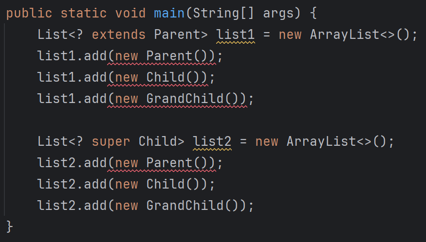

# Generic 와일드카드를 이용한 extends, super 사용 시 주의할 점

## <? extends Parent>

- 이 클래스의 타입 변수는 Parent 또는 이를 상속하는 클래스에 매핑됨을 의미
- 즉, 각 요소를 Parent 타입으로 취급 (T → Parent)
- 그런데 여기에서 add를 호출하는 것은 실제 값을 타입 변수에 매핑하는 것과 같은 행동
- 즉, Parent, Child, GrandChild → T
- 이 방향으로의 매핑은 불가능함. 왜? ? extends Parent는 Parent일 수도, Child일 수도, 그 하위의 구체 클래스일 수도 있음
- 근데 Parent 객체를 넣어버리면 `Child c = new Parent();` 를 선언하는 것과 같아져버려 문제가 생김

## <? super Child>

- 이 경우는 타입 변수가 이 클래스의 상위 클래스에 매핑됨을 의미
- 즉, 모든 클래스가 Child 또는 그 상위의 것임을 보장할 수 있기 때문에, 타입을 Child로 하여 선언이 가능하며, 따라서 Child 또는 그 하위의 클래스는 추가할 수 있게 됨
    - `Child c = new GrandChild();` 처럼 동작하는 것

## 출처

[StackOverflow - 와일드타입 컬렉션에 데이터를 추가할  수 없는 이유?](https://stackoverflow.com/questions/3716920/cant-add-value-to-the-java-collection-with-wildcard-generic-type)
