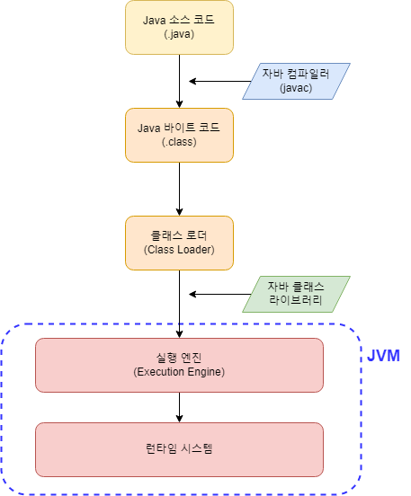

# 🗃 JVM

## JVM (Java Virtual Machine)

Java로 작성된 소스 코드(프로그램)를 실행하기 위한 프로그램

## JVM의 목적

1. JVM은 Java 프로그램을 어떤 OS든 동일하게 동작하도록 만든다.
즉, OS에 의존적이지 않도록 한다.
2. JVM은 Java 프로그램이 효율적으로 실행될 수 있도록 `메모리를 관리`하고 `최적화`한다.

## JAVA 프로그램의 실행 절차

### 구성 요소

- `자바 컴파일러(javac)`: 자바 소스코드(.java)를 실행 가능한 바이트코드(.class)로 변환
- `클래스 로더`: 외부 클래스를 가져와 로드하고 메모리 영역에 배치
- `실행 엔진`: 바이트 코드를 실행
- `런타임 시스템`: JVM이 할당받아 관리하는 메모리 영역이 이에 포함된다.

### 동작 절차

1. 프로그램이 실행되면 JVM은 OS로부터 해당 프로그램의 실행에 필요한 메모리 영역을 할당받는다. 이 공간의 관리는 JVM이 맡는다.
2. 자바 컴파일러가 자바 소스코드(.java)를 컴파일하여 바이트코드(.class)로 변환한다.
3. 클래스 로더는 바이트코드를 읽어 메모리 영역으로 로딩한다. 이 과정에서 외부 라이브러리들도 포함된다.
4. 메모리 영역에 올라간 클래스 파일들은 실행 엔진에 의해 실행된다.
5. JVM은 할당받은 메모리의 최적화를 위해 스레드 동기화, 가비지 컬렉션과 같은 메모리 관리 작업도 수행한다.