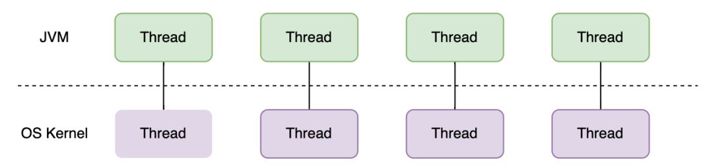
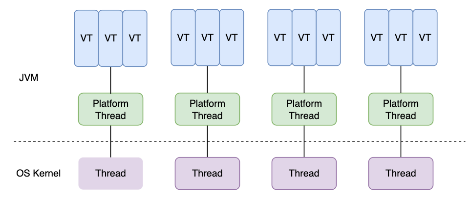

# Java 21 - Virtual Thread

## Java 21?

- 2021년 출시된 Java 17 이후 2년만에 출시된 Java의 4번째 LTS(Long Term Support) 버전
- 주요 변화는 다음과 같다.
    - [Sequenced Collections](./Java21_Sequenced_Collections.md)
    - **Virtual Thread**
    - [Record, Switch 개선](./Java21_Improvement_Record,_Switch.md)
- 이 글에서는 Virtual Thread에 대해 다룬다.

## 기존의 Java 스레드

- 하나의 스레드가 하나의 OS 스레드와 1:1 관계를 가지며, 동일하게 동작함
    - 고비용이며, 개수가 극히 제한되어 있으며, I/O 작업을 수행하면 blocking
- 스레드는 고비용이기 때문에, 필요할 때마다 생성해서 사용하는 대신 `스레드 풀에 일정 개수 스레드를 할당`하고 `필요할 때 꺼내 쓰고 다 쓰면 다시 반환`
- 현대의 대부분의 자바의 사용처인 서버 애플리케이션은 여러 I/O 작업을 동반하며, 이에 따라 성능 저하가 발생
    - 스레드가 I/O 대기 등으로 인해 사용 불가능하게 되고, 스레드 풀 내 모든 스레드가 사용 불가능하면 뒤의 요청들은 대기 큐에서 대기
    - 이 문제를 해결하자고 스레드 풀 내 스레드 수를 늘리자니, 물리적으로 한계가 있음
- 이러한 문제를 해결하기 위해 비동기 I/O (reactor)가 도입되는 시도도 있었으나, `너무 코드가 어렵고` `코드 실행 흐름을 예측하기 어려워지는` 문제로 잘 사용되지는 않음

## Java 21에 도입된 가상 스레드

- 기존 스레드는 `플랫폼 스레드(Platform Thread)`라는 명칭으로, 여전히 Thread Pool 내에 존재
- 기존 스레드와 `다대다 관계`를 갖는 가상 스레드가 도입됨
- 가상 스레드는 다음과 같은 특징을 가짐
    - 기존 스레드보다 가벼움 - 생성 비용, 스위칭 비용이 저렴
    - 기존 스레드보다 효율적 - I/O에 의해 OS스레드가 놀지 않도록 동작

### 기존 스레드보다 가벼움

- Context Switching 비용이 더 적음
- 메모리를 덜 사용
- I/O blocking에 의한 시간 낭비도 더 적음

### 기존 스레드보다 효율적

- 하나의 가상 스레드가 여러 플랫폼 스레드에 의해 사용되기도 하며, 하나의 플랫폼 스레드는 여러 가상 스레드를 사용 (N:M)
- 플랫폼 스레드가 사용 중인 가상 스레드가 I/O에 의해 응답 대기 상태에 접어들면, `다른 가상 스레드를 실행`하여 플랫폼 스레드가 놀지 않도록 함
- 따라서, 동기로 동작하도록 짜인 코드도 `실제로는 비동기처럼 동작하도록` 할 수 있음

## 가상 스레드를 사용할 때 주의할 점

### Pinned Thread가 발생하지 않도록 주의

- `Pinned` 란, 가상 스레드가 캐리어에 고정되는 현상을 말함
    - 캐리어란, 가상 스레드의 실행 주체로 프로세서와 동일하다고 보면 됨
- 가상 스레드가 캐리어에 고정되면 해당 가상 스레드가 blocking 되었을 때 이를 실행 중인 플랫폼 스레드도 함께 blocking
    - 즉, 기존 스레드의 동작과 동일해짐
- Pinned Thread는 두 가지 상황에서 발생
    - `synchronized` 사용
    - 네이티브 메서드나 외부 함수를 사용

### ThreadLocal 사용 시 주의

- 가상 스레드의 개수는 매우 많음
    - 이 가상 스레드마다 ThreadLocal을 사용하게되면, 그 크기가 아무리 작더라도 차지하는 메모리의 양을 무시할 수 없게 됨

### Pooling이 필요 없음

- 가상 스레드의 생성 비용은 매우 저렴
- 따라서 필요 시마다 생성하는 것이 별도의 스레드 풀을 사용하는 것보다 간편

### CPU를 주로 사용하는 작업에서는 성능 개선을 기대할 수 없음

- 기존 스레드의 문제는 I/O가 발생할 때 blocking이 발생한다는 점
- 가상 스레드가 개선한 것 역시 이 부분으로, I/O가 발생해도 스레드가 wait 상태가 되는 대신 다른 동작을 실행할 수 있도록 한 것
- 따라서 코드 자체를 더 빠르게 실행하는 것은 아니며, 오히려 CPU를 사용하는 동작에서는 Thread Switching 동작이 더 자주 발생하므로 약간 성능이 저하된다고 볼 수 있음

## 출처

- [망나니개발자 - **기존 자바 스레드 모델의 한계와 자바 21의 가상 스레드(Virtual Thread)의 도입**](https://mangkyu.tistory.com/309)
- [최범균 - 자바21 주요 특징3 - 가상 쓰레드](https://www.youtube.com/watch?v=srpOD6WIasM)