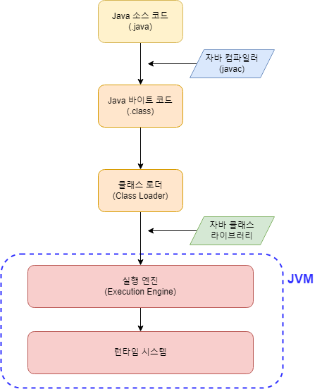

# Java 코드의 실행 과정

## Java의 특징

* 컴파일 언어이다.
  * 컴파일 언어란? 컴파일러를 통해 기계가 실행할 수 있는 코드로 이루어진 출력물을 만들어낸 뒤 실행되는 언어를 말한다. Java는 그 중에서도 JVM(자바 가상 머신)이 실행할 수 있는 코드인 바이트 코드(.class 파일)로 컴파일된다.
* Java의 큰 특징은 OS에 종속적이지 않다는 것이다. 이는 자바 프로그램을 실행하는 JVM(Java Virtual Machine) 덕분이다.

## JVM

* 자바 컴파일러(javac)에 의해 생성된 바이트코드(.class)를 메모리에 적재하고 실행하는 주체
* 다음의 요소를 통해 동작한다.
  * Class Loader
  * Execution Engine
  * Runtime Data Areas
* Runtime Data Areas
  * JVM이 바이트코드를 할당하기 할 수 있도록 JVM에게 주어진 메모리 공간
* Class Loader
  * 바이트코드를 읽어 사용할 클래스들을 런타임 데이터 영역에 적재한다. 이 과정을 동적 로딩(Dynamic Loading)이라고 한다.
* Execution Engine
  * JVM의 런타임 데이터 영역에 적재된 바이트코드들을 명령어 단위로 읽어들여 실행한다.

## Java 코드의 실행 과정

Java 코드는 다음의 순서로 변환되고 실행된다.

1. 프로그래머에 의해 High Level Language인 Java 언어로 프로그램이 작성됨 (.java)
2. 자바 컴파일러에 의해 바이트코드로 변환됨 (.class)
3. 바이트코드가 클래스로더에 의해 런타임 메모리 영역에 적재
4. 실행 엔진에 의해 명령어 단위로 프로그램이 실행됨
   * 실행 엔진은 두 가지로 나뉜다.
   * 인터프리터 방식: 명령어 단위로 해석하고 직후 실행
   * 컴파일러(JIT) 방식: 전체 바이트 코드를 해석하여 바이너리 코드로 변환하고 실행

## 실행 엔진 비교

* 인터프리터 방식
  * 한 문장마다의 실행 속도는 빠르지만 전체 코드의 실행 속도는 느리다.
* JIT(Just-In-Time) 컴파일러 방식
  * 인터프리터 방식은 전체 코드의 실행 속도가 느리기 때문에 이를 보완하기 위해 추후에 등장한 방식
  * 한 문장마다의 실행 속도는 인터프리터 방식보다 느리지만 전체 코드의 실행 속도는 더 빠르다.

출처: [https://steady-snail.tistory.com/67](https://steady-snail.tistory.com/67)
