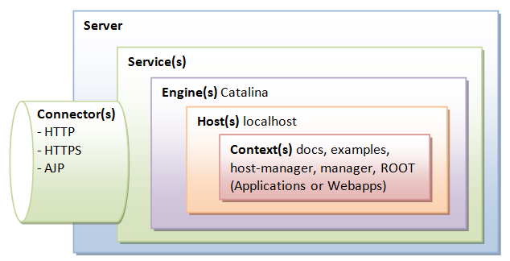

# Tomcat Architecture

## 톰캣은 WAS가 아니라 서블릿 컨테이너

### WAS란?

- Jakarta EE(전 Java EE)라는 명세를 구현하는 구현체를 WAS라고 함

### 서블릿 컨테이너

- 톰캣은 Jakarta EE의 전체 명세를 구현하는 대신 Servlet과 JSP 실행 환경을 제공하는 데에 집중하기 때문에 WAS보다는 서블릿 컨테이너로 분류됨

## 톰캣 아키텍처

https://www3.ntu.edu.sg/home/ehchua/programming/howto/Tomcat_More.html

- 톰캣 **서버**는 여러 개의 **서비스**로 구성
- 각 **서비스**는 하나의 **엔진**과 여러 개의 **커넥터**를 포함하며, 커넥터를 통해 클라이언트의 요청을 받고 엔진에서 처리한 뒤 응답을 전달하는 역할을 수행
- **엔진**은 요청을 처리하는 주체로, 도메인으로 분류되는 여러 **호스트**를 포함
- **커넥터**는 특정 프로토콜/특정 포트의 요청을 받아 적절한 엔진으로 전달하는 역할을 수행
- **호스트**는 도메인과 연결된 하나의 웹사이트로, 한 개 이상의 **컨텍스트**를 포함할 수 있음
- **컨텍스트**는 개별 웹 애플리케이션으로, 루트 디렉토리와 설정 정보를 포함
- 그 외에도 아래와 같은 구성 요소가 존재
    - **Realm(렐름)** - 인증/권한 부여를 담당하는 컴포넌트
    - **Valve(밸브)** -  요청을 가로채 특정 처리를 수행할 수 있는 컴포넌트

## Connector

- 클라이언트의 웹 요청을 받아 적절한 애플리케이션으로 전달하는 역할을 수행

### 커넥터의 종류

- HTTP/HTTPS 호출을 위한 HTTP 1.1 커넥터
    - HTTP 2 프로토콜을 사용하고 싶으면 `server.xml` 파일의 HTTP 1.1 커넥터 태그 내에서 HTTP 2 UpgradeProtocol을 지정하면 됨
- AJP(Apache JServ Protocol) 호출을 위한 AJP/1.3 커넥터

### AJP 커넥터

- 톰캣-웹서버 간 통신 최적화를 위한 프로토콜 (톰캣-웹서버 간 HTTP를 쓰는 것보다 빠름)
- Spring Boot를 사용하는 경우에는 보통 내장 톰캣을 이용하며 별도 정적 서버를 두지 않으므로 AJP 프로토콜을 사용하지는 않음
    - 독립적 단일 서버를 관리함으로써 배포 및 관리 용이성을 향상시킬 수 있기 때문
- AJP가 톰캣-웹서버 통신에 있어서는 HTTP보다 빠른 이유는 아래와 같음
    - 바이너리 포맷 사용으로 프로토콜 오버헤드 절감 - HTTP는 어쨌든 텍스트 기반. 바이너리 프로토콜은 필요한 패킷 수, 패킷의 크기가 절감 가능
    - 바이너리 인코딩 - HTTP 메서드, 헤더 등에 대한 바이너리 인코딩을 정의 (GET을 2바이트로 표현)
    - 연결 유지 - HTTP/1.1 Keep-Alive보다 더 효율적으로 연결을 재사용해 핸드쉐이크 비용을 절감
    - 부하 분산 - 정적 컨텐츠는 Apache가, 동적 컨텐츠는 AJP를 통해 Tomcat으로 전달

### HTTP 커넥터

- HTTP 프로토콜로 서블릿/JSP에 대한 요청, 정적 컨텐츠 리소스에 대한 요청을 처리하는 커넥터(자바 클래스)
- 기본적으로 SpringBoot의 내장 톰캣에서도 8080포트를 리스닝하는 HTTP/1.1 커넥터를 사용
- HTTP 커넥터의 종류는 다음과 같음
    - HTTP/1.1 커넥터
    - NIO HTTP 커넥터
    - ARP HTTP 커넥터
- 내부적으로 스레드 풀을 사용하며 이 풀은 `ThreadPoolExecutor`를 통해 관리됨

### 프로토콜 구현체

- 클라이언트-서버 간 통신 방식을 정의하는 구성 요소
- BIO/NIO/APR 3종류가 있는데 BIO는 Tomcat 8.0부터 삭제됨
- 현재 SpringBoot에서는 `Http11NioProtocol` 을 사용

### HTTP 11 NIO Protocol

- 현재 기본적으로 사용하는 HTTP 커넥터
- 비동기식 I/O를 사용
- 구성 요소는 다음과 같음
    - Acceptor - 소켓 연결을 수락하고 이벤트 큐에 캡슐화한 소켓 채널을 발행
    - Poller - 이벤트 큐로부터 Acceptor가 넣은 이벤트를 소비. 소켓 채널을 Selector에 등록. Selector는 소켓을 알맞은 워커 스레드에 전달
    - Executor(Worker Thread) - 소켓을 받아 Engine(Servlet)에 요청을 위임
- Poller와 Acceptor는 무한 루프를 돌며 큐에 넣을 것을 받아 넣고 큐에서 꺼내는 단일 데몬 스레드
