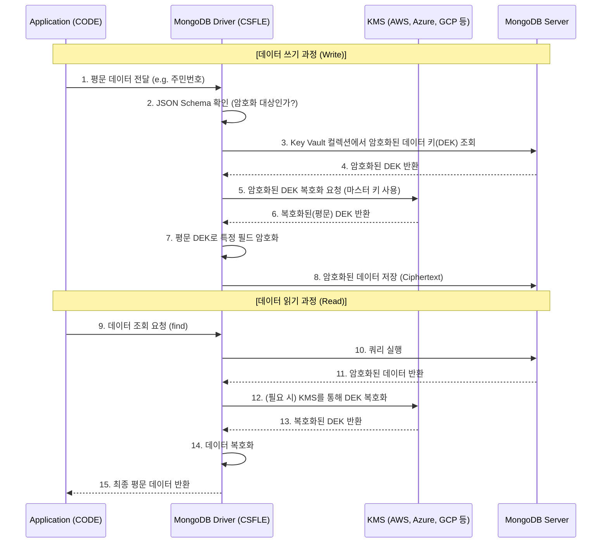

# CSFLE (Client-Side Field Level Encryption)

## 클라이언트 측 필드 레벨 암호화

- 말그대로 클라이언트에서 MongoDB에 데이터를 보내기 전에 암호화해서 보내는 기능

### 왜 클라이언트 측에서 암호화 하는가?

- **DB 접근이 가능한 사람도 데이터를 볼 수 없도록 하기 위함**
- MongoDB가 받아서 암호화 하게 되면? 데이터베이스 관리자나 MongoDB 서버의 침입자가 메모리/로그 확인을 통해 원본 데이터를 볼 수 있음
- 클라이언트 측에서 암호화해서 보내면 네트워크 패킷 탈취든 MongoDB 권한 탈취든 이 데이터 원본을 확인할 방법이 없어지므로 더 안전
- MongoDB의 모든 권한이 넘어가더라도, 데이터를 암호화한 키는 다른 곳(애플리케이션 서버 또는 아예 별도의 KMS)에 있기 때문에 원본 데이터 유출을 피할 수 있음

### 어떻게 동작하는가?

- CSFLE에서는 아래 2가지 키를 사용
    - **CMK**: 애플리케이션/KMS가 관리하는 마스터 키로, DEK 생성 및 전체 데이터 암호화를 위해 사용됨
    - **DEK**: 마스터 키를 이용해 생성되는 데이터 키로, 실제 데이터(각 필드) 암호화에 사용되며, **MongoDB 내** 별도 컬렉션에 암호화된 상태로 저장됨 (암호화 주체: CMK)
    - 즉, CMK는 애플리케이션 또는 별도 KMS가, DEK는 MongoDB가 소유
- 동작 방식은 아래와 같음

- 읽기 과정은 세부적으로 아래와 같이 동작
    1. 암호화된 데이터와 DEK의 Key ID를 조회
    2. 해당 Key ID의 복호화된 DEK가 애플리케이션에 캐싱되어 있으면 이를 바로 사용
    3. 캐시에 없으면 DEK가 저장된 컬렉션(Key Vault 컬렉션)을 조회하여 암호화된 DEK 획득 후 CMK를 통해 복호화 해서 사용

### 그냥 단일 키로 클라이언트에서 암호화 해서 보내고 이 키로 복호화 하면 안 되나?

- 왜 이렇게 복잡하게 할까? 그냥 하나의 키만 쓰면 안 되는 걸까? 하지만 아래와 같은 이유가 있다.
- **Key Rotation 용이성**
    - 보안 컴플라이언스(ISMS 등)를 지키려면 보통 1년마다 암호화 키를 새것으로 교체해야 함
    - 단일 키로 모든 데이터를 암호화한다면, 이 키가 바뀔 때 **이 키로 암호화한 모든 데이터를 다시 복호화 하고 재암호화 해야 함**
    - CSFLE 사용 시 별도 Key Vault 컬렉션을 관리하므로 **Key Vault 컬렉션의 DEK들만 재암호화** 하면 되므로 간단하고 빠르게 키 교체 반영 가능
- **개인정보 소유자의 ‘잊힐 권리’ 구현을 위함 (Crypto Shredding)**
    - 사용자가 자신의 개인정보 파기를 원할 시 모든 개인정보를 삭제해야 하는데, ‘완벽히 100% 삭제’가 현실적으로 어려울 수 있음 (실수하거나, 어딘가에 백업이 남아있거나 등의 이유로)
    - CSFLE 사용 시 해당 사용자의 DEK만 삭제하면 데이터를 복호화할 수 없게 되므로 모든 개인정보 파기와 동일하게 동작함

### 결정적 암호화(Deterministic)와 랜덤 암호화(Randomized)

- 암호화할 때는 2가지 암호화 알고리즘 중 하나를 사용
- 결정적 암호화는 동일 평문 - 동일 암호문이 나오는 알고리즘으로, DB 조회 시 이 데이터를 조회 조건으로 사용할 수 있음
- 랜덤 암호화는 암호화할 때마다 임의 값을 섞어 암호화해 동일 평문이어도 매번 다른 암호문이 나오게 하는 알고리즘으로, 더 안전하지만 조회 조건으로 사용할 수는 없음
- 결정적 암호화는 조회 조건이 될 수 있는 고유 식별자(카디널리티가 높은 데이터)를 암호화하는 데에 사용하고, 그 외의 민감정보에는 랜덤 암호화를 사용하는 것이 좋음
