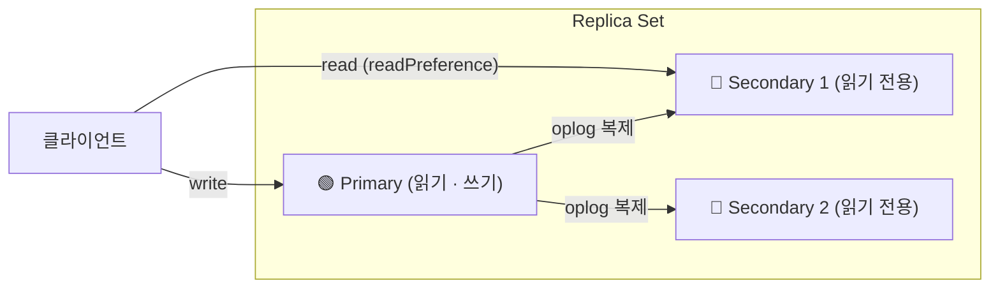
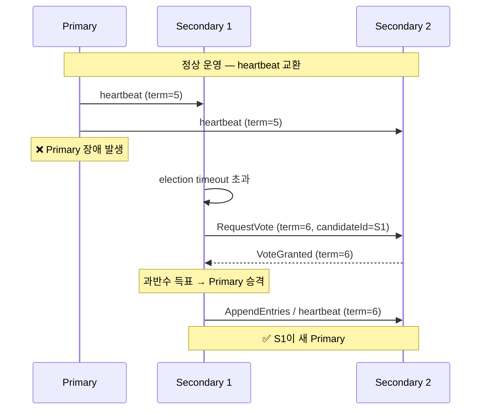
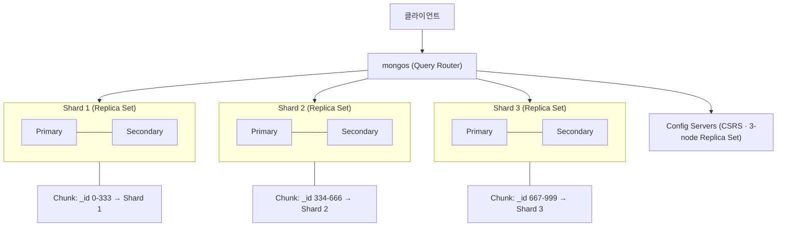

## 분산 환경에서 주로 사용되는 3요소
- 복제는 무결성을
- 합의는 가용성과 페일오버(장애 회복)을
- 샤딩은 수평 확장을 위해 사용한다.

## 복제 (Replication): 데이터 무결성과 고가용성

- 복제란? 다수 개 노드에 동일한 데이터를 복제하여 저장하는 기법
- 다중 노드로 MongoDB 클러스터를 구성하고, 1개의 Primary, 다수 개의 Secondary를 둔다.
- 쓰기는 **Primary**만 처리한다. Primary는 `oplog` 라고 부르는 '고정 크기 컬렉션'에 데이터를 쓰고, **Secondary** 노드들은 이 `oplog` 데이터를 비동기적으로 fetching 하여 자신의 데이터베이스에서 재실행(Replay)하여 데이터를 복제한다.
	- oplog는 '데이터'가 아닌 '명령'을 저장하는 파일임을 알 수 있음.
- 즉 Primary에 쓴 것은 Secondary에 비동기로 복제되므로, Primary가 죽더라도 Secondary에 데이터가 보존되어 데이터 유실을 막을 수 있다.
- 또한 약간 뒤쳐진 버전을 허용하는 데이터라면, Primary의 부담을 줄이기 위해 Secondary에서 읽도록 하여 부하를 분산할 수도 있다.

## 합의: 스플릿 브레인 방지, 자동 리더 선출을 통한 자가 회복

- 합의란? Primary 장애 상황에 특정 Secondary가 새 Primary로 선출되도록 하는 기법
- Primary가 SPOF가 되는 것을 막고, Primary 노드가 죽었을 때 클러스터가 스스로 회복할 수 있도록 한다.
- MongoDB 클러스터 내 노드들은 서로 하트비트(Heartbeats) 모니터링을 위한 Ping 요청을 보내 서로 헬스체크를 한다. Primary가 10초 이상 하트비트에 응답하지 않으면 Primary가 죽었다고 판단한다.
- Secondary는 Primary가 죽었다고 판단하면 자기 자신을 새로운 Primary 후보로 등록하고 투표를 요청한다. 선거에서 승리하려면 반드시 과반수인 `(전체 노드) / 2의 올림 값` 만큼의 동의를 얻어야 한다.
- 다수결을 위해 데이터 복제는 하지 않고 투표 전용 노드인 Arbiter 노드를 두기도 한다.
### 왜 홀수 개로 구성할까?
- 홀수 개로 구성하는 것은 단순히 과반수가 가능하도록 하기 위함 아닌, 스플릿 브레인 방지 목적이 더 크다.
- 홀수 개로 구성하게 되면 네트워크 파티션이 발생했을 때 한 쪽은 절대 리더를 선출할 수 없음. 그래서 리더가 여러 개가 되어 데이터가 오염되는 문제를 방지할 수 있다.
### 어떻게 반드시 리더가 선출됨을 보장할까?
- 어쨌든 홀수 개로 구성하면 Primary가 죽었을 때 남는 노드 수는 짝수 개다. 그러면 결판이 안 날 수도 있는 건데?
- 이 문제는 아래와 같은 메커니즘 덕분에 해소가 가능하다고 한다.
	1. 랜덤 타이머: 모든 노드가 동시에 투표를 시작하는 것이 아니라, 랜덤 타이머 만큼 대기하고 투표를 시작한다. 따라서, (아주 높은 확률로) 가장 먼저 타이머가 종료된 단 하나의 노드가 투표를 먼저 시작하게 되고, 나머지 노드는 이 노드에게 투표하게 된다.
	2. 투표 타임아웃: 정말 운 나쁘게 동률이 발생해 각 노드가 자기 자신에게 투표하여 데드락이 발생한다고 해도, 해당 선거는 타임아웃에 의해 무효처리 된다.
	3. 최신 데이터 검증: 노드는 투표 요청을 받았을 때 해당 노드가 자기 자신 대비 더 최신이거나 같은 상태의 데이터를 가질 때에만 표를 준다.

## 샤딩

- 샤딩이란? 데이터를 여러 서버에 분산시켜 저장하는 기법
- 저장되는 데이터 수가 너무 많아져 각 노드가 전체 데이터를 관리하기 어려운 순간이 오면 샤딩 도입을 검토
	- 앞에서 본 복제와 합의는 MongoDB ReplicaSet을 구축할 때 거의 필수적 요소. 하지만 샤딩은 인프라 복잡도를 매우 높이기 때문에 정말 필요할 때 도입해야 함.
- 애플리케이션은 `mongos` 라는 라우터에 연결하여 쿼리를 전송하고, 이 라우터가 쿼리를 분석하여 목표 데이터가 있는 샤드를 찾고, 알맞은 샤드에게 요청을 라우팅한다.
- 어떤 데이터가 어느 샤드에 있는지는 `Config server`를 통해 관리되며, 이 또한 안전을 위해 ReplicaSet 방식으로 동작한다.
- 샤드 키를 잘 설계하여 데이터가 고루 분배되도록 하는 것이 핵심이다.
