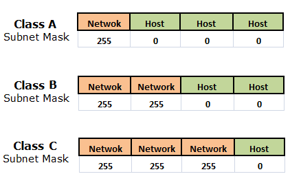
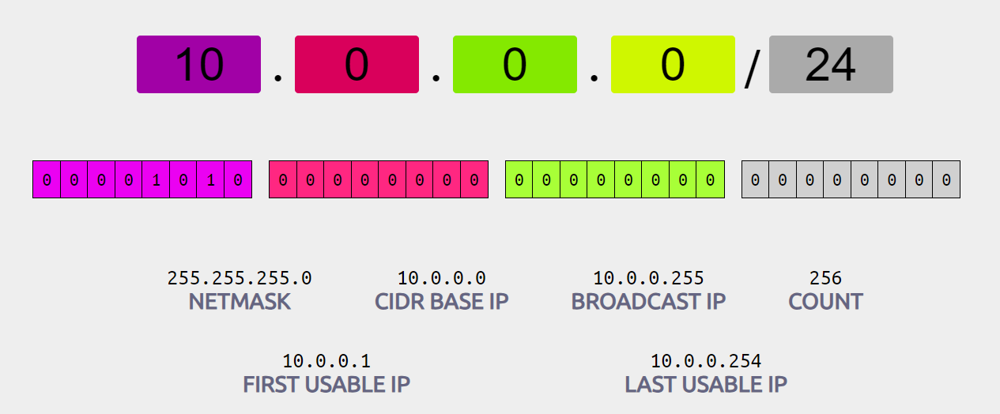

## CIDR (Classless Inter Domain Routing)

- IP 주소 영역을 여러 네트워크 영역으로 나누기 위해 IP를 그룹화하는 방식

### Class 기반 주소 지정 시스템

- 1990년대 초반까지 사용하던 IP 주소 할당 방식
- 주소의 길이, 네트워크/호스트 부분에 각각 할당되는 비트 수 모두 고정됨
- 클래스 A, B, C 중 하나의 IP 주소를 부여받을 수 있으며 각각 네트워크 비트가 8, 16, 24 비트
- 호스트 비트가 작아질수록 IP를 할당할 수 있는 디바이스 수가 적어짐

### Class 기반 주소 지정 시스템의 문제점

- **고정된 IP 주소 지정에 따른 주소 공간 낭비 발생 가능**
    - Class A, B, C는 각각 약 1600만개, 6만 5천개, 254개의 호스트 주소를 사용 가능
    - 만약 2만 개의 호스트 주소가 필요한 조직이 있다면? Class B의 IP 주소를 신청해야 함
    - 하지만 2만 개의 주소만 사용할 것이므로, 나머지 4만 5천개의 주소는 사용되지 않고 낭비됨
- **네트워크 설계의 제한**
    - 서브넷 마스크가 고정이기 때문에, 서로 다른 클래스에 속한 두 네트워크는 결합이 불가능

### Classless 주소 지정 (CIDR)

- 가변 길이의 서브넷 마스킹을 통해 네트워크/호스트 부분에 할당되는 비트 수 비율을 유동적으로 변경
- / 이후의 숫자만큼이 네트워크 영역, 나머지가 호스트 영역에 해당
- [https://cidr.xyz](https://cidr.xyz/) 에서 CIDR 블록을 지정해 실제 네트워크/호스트 비트를 확인할 수 있음

### CIDR 주소 지정 방식의 이점

- **고정 방식에 비해 IP 낭비 감소**
    - 서브넷 마스크를 유동적으로 결정할 수 있으므로, 고정 방식에 비해 조직에 필요한 수만큼의 호스트 주소 할당 가능
- **네트워크 간 결합에 용이**
    - 네트워크 비트를 원하는대로 조정함으로써 결합하고자 하는 두 네트워크를 클래스 레벨에 상관 없이 결합 가능
    - 이를 통해 내부에서는 불필요한 네트워크 간 통신을 없앨 수 있어 데이터 전송 속도 증가의 이점도 누릴 수 있음

### 출처

[CIDR이란?- CIDR 블록 및 표기법 설명 - AWS](https://aws.amazon.com/ko/what-is/cidr/)
