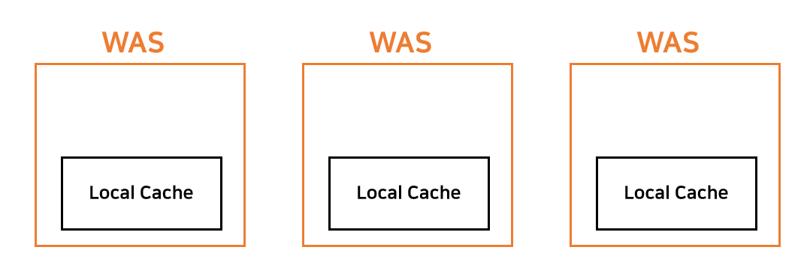
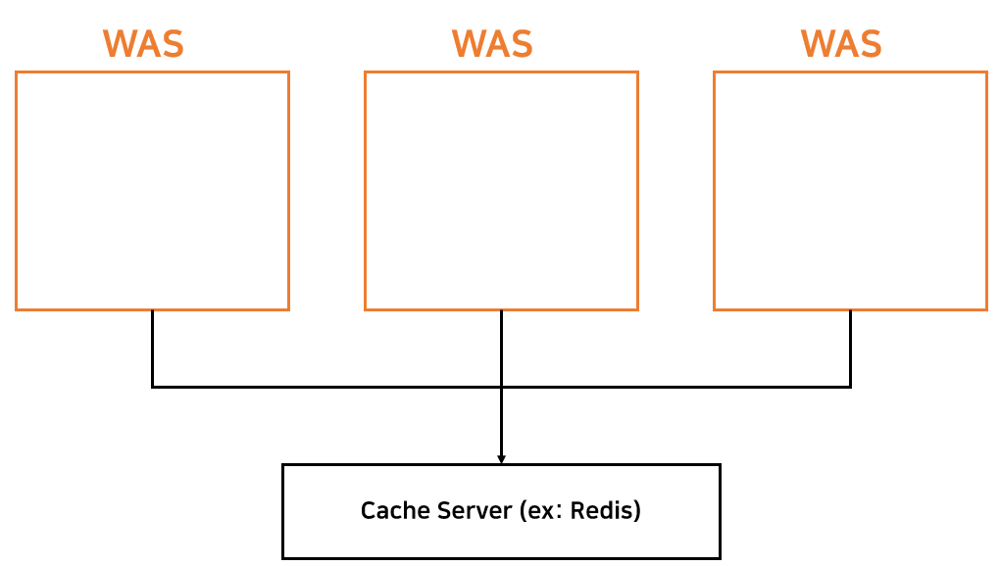

# Cache

## Cache가 필요한 이유

데이터베이스에 접근하여 데이터를 얻어오는 일은 매우 느리게 처리되는 동작이다. 그러나 데이터 중에서는 `자주 변경되는 것`과 그렇지 않은 것, `자주 조회되는 것`과 그렇지 않은 것이 있다. 이러한 특성을 잘 고려하여 데이터를 보관하고 재사용한다면 애플리케이션의 속도를 향상시킬 수도 있으며, 비용을 절감할 수도 있다.

캐시는 캐싱된 데이터의 위치에 따라 로컬 캐시, 글로벌 캐시 두 가지 종류로 나뉜다.

## Local Cache

로컬 캐시는 애플리케이션 서버(WAS) 내부에 존재하는 캐시를 말한다.

### 장점

- 어플리케이션(WAS) 내에 캐시를 가지므로 가장 접근 속도가 빠르다.

### 단점

- 서버가 여러 대일 때, 캐시 간 동기화를 보장할 수 없다.
- 서버의 물리적 메모리 때문에 캐시 크기 또한 공간적 제약이 존재한다.

### 특징

- 로컬 캐시는 동기화를 보장할 수 없기 때문에 변화가 자주 일어나지 않는 `정적 데이터`에 주로 사용한다.

## Global Cache

글로벌 캐시는 별도의 캐시 서버를 두어 해당 서버 내에 저장되는 캐시를 말한다.

### 장점

- 로컬 캐시에서의 동기화 문제가 발생하지 않는다.

### 단점

- 네트워크 호출이 발생한다. 캐시의 장점 중 하나는 네트워크 비용을 줄이는 것인데, 결국 별도 서버에 요청하므로 이러한 장점을 살리지 못하는 것이다.
- 로컬 캐시에 비해 속도가 느리다.
- 캐시 서버에 장애가 생길 경우를 대비해야 한다.

### 특징

- 글로벌 캐시는 로컬 캐시에 비해 느리지만(DB 서버에 요청하는 것보다는 훨씬 빠름) 동기화 문제가 발생하지 않으므로 자주 변화하는 `동적 데이터`에 주로 사용한다.
