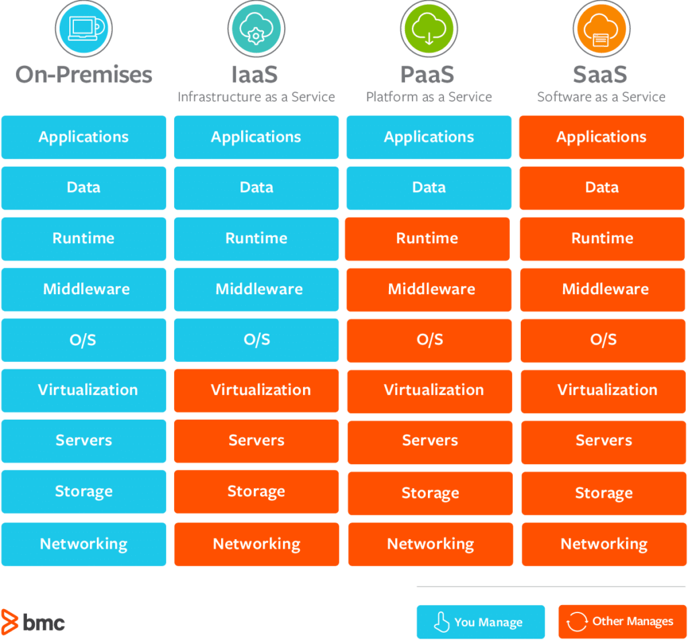

# Cloud Service

## 클라우드 서비스

클라우드 서비스란, 서비스의 운영을 위해 필요한 리소스(서버, 스토리지, 소프트웨어 등)를 제공하는 서비스를 말한다.

클라우드 서비스를 이용하는 고객은 클라우드 서비스의 유형에 따라 일반 사용자이기도, 다른 서비스의 개발자이기도 하다. 아래에서는 주로 사용되는 클라우드 서비스를 유형별로 정리해보았다.

## 클라우드 서비스의 유형

 출처: bmc

### On-Premise

* 클라우드 서비스가 등장하기 이전의 전통적인 인프라 구축/관리 방식
* 모든 리소스를 기업이 직접 마련하고 관리
* 장점: 보안성이 높다.
* 단점: 시스템의 구축 및 관리에 많은 시간과 비용을 소모하게 된다.

### IaaS (Infrastructure-as-a-Service)

* 핵심 IT 자원(가상/전용 하드웨어, 네트워킹, 스토리지)을 제공하는 서비스
* 사용자는 OS, 미들웨어, 런타임 등을 선택하여 자신의(또는 속한 기업의) 애플리케이션, SW만을 운영할 수 있으며, 하부의 리소스의 관리 및 운영 책임은 IaaS 서비스 제공자에게 있다.
* 예시: Amazon AWS, Microsoft Azure, Google의 GCE

### PaaS (Platform-as-a-Service)

* 인프라 구조 전반을 제공하는 서비스
* 사용자는 자신의 애플리케이션의 관리 책임만 가져 효율적인 개발을 할 수 있다.
* 예시: Heroku 등

### SaaS (Software-as-a-Service)

* SW 자체를 제공하는 서비스
* 사용자는 별도의 설치 과정 등이 없어도 네트워크에 연결된 컴퓨터만으로 서비스를 이용할 수 있다.
* 앞선 IaaS, PaaS는 주요 고객층이 애플리케이션을 제공하고자 하는 개발자(기업)라면, SaaS는 종단 사용자(end-user)가 주요 고객층이다.
* 최근에는 대부분의 SaaS가 IaaS 또는 PaaS 기반으로 제공된다.
* 예시: Notion, Google Drive 등

## 출처

[https://kinsta.com/blog/types-of-cloud-computing/](https://kinsta.com/blog/types-of-cloud-computing/)
