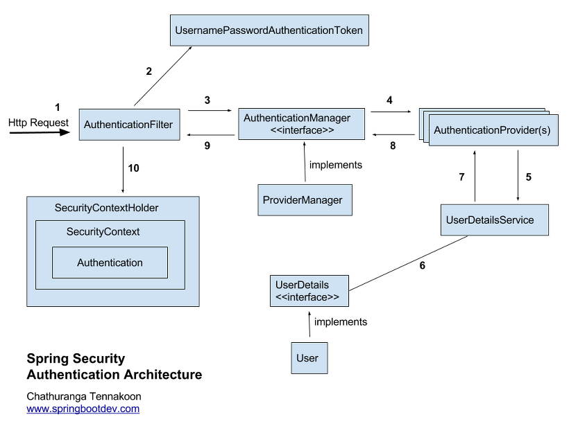

# Spring Security

> 본 글은 Spring Security 5.7 이전 버전의 아키텍처를 기반으로 작성되었습니다.

## Spring Security

### 정의

* Spring 기반 앱의 `인증`과 `인가`를 위한 Spring의 하위 프레임워크
* `Filter` 기반으로 동작한다.

### Security가 관여하는 영역

클라이언트/서버의 인증 기반 통신 흐름은 다음과 같다.

1. 사용자의 로그인 요청 시, 정보가 맞다면 세션, 토큰 등의 방식에 따라 생성된 인증 정보가 전달됨
2. 이 정보는 쿠키, 로컬 스토리지 등의 브라우저 저장소에 저장됨
3. 사용자는 인증이 필요한 리소스를 요청할 때 이 정보를 요청과 함께 전송
4. 서버는 이 정보를 해석하여 사용자가 소유한 권한을 확인하고, 허용된 리소스라면 이를 제공

Spring Security가 관여하는 것은 1번과 4번으로, 1번은 인증 과정, 4번은 인가 과정에 해당한다.

### 인증 (Authentication)

* 해당 사용자가 올바른 사용자인지 검증하는 절차
* Spring Security에서는 인증을 위해 두 가지 정보를 사용한다.
  * Principle - 인증을 요청한 사용자 (또는 사용자의 아이디). Unique해야 함
  * Credential - 해당 사용자의 비밀번호

### 인가 (Authorization)

* 인증된 사용자가 리소스를 요청하면, 해당 사용자가 해당 리소스에 접근할 수 있는 권한을 가졌는지 검증하는 절차
* Spring Security에서는 Role과 Authority를 통해 사용자에게 부여된 권한을 관리한다.
  * Role - 어떤 역할을 가졌는가? (관리자, 일반 사용자 등)
  * Authority - 어떤 권한을 가졌는가? (읽기, 수정, 삭제 등)

## Spring Security Architecture

### Security Filter들은 Bean이면서 Filter

`Filter`는 `Filter Chain`이라는 구조로 순차적으로 적용되며, Spring Security에서 제공하는 기능들을 수행하는 Filter 또한 Filter Chain의 일부로 존재한다.

그러나 Security 관련 Filter들은 모두 Bean인데, 일반적으로 Filter는 Dispatcher Servlet에 전달되기 이전에 적용되는 Servlet에 해당한다.

Security의 Filter들은 Bean으로 적용되기 위해 `DelegatingFilterProxy`를 이용하며, 실제 필터에 해당하는 `DelegatingFilterProxy`가 Bean인 FilterChainProxy를 호출해 시큐리티 관련 로직을 처리할 수 있도록 한다.


### SecurityFilterChain

하나의 SecurityFilterChain은 한 종류의 특정 path(ex: /api/\*\*)에 대한 접근 제어를 수행한다.

각 FilterChain에 요청을 전달하는 `FilterChainProxy`는 request가 도착했을 때 request의 url path를 확인해 다수 개의 SecurityFilterChain 중 어떤 FilterChain을 적용할지 결정한다.

하나의 요청은 하나의 FilterChain에만 매핑되며, 이외의 FilterChain은 무시된다.

### 하나의 SecurityFilterChain 내에서 이루어지는 일



1. `AuthenticationFilter`는 인증 절차를 순차적으로 호출하고 인증된 사용자를 요청 전반에서 사용할 수 있도록 SecurityContext에 등록한다.
2. `UsernamePasswordAuthenticationToken`은 사용자의 정보를 담고 있는 객체로, Principal, Credentials, Authorities에 대한 정보를 저장한다.
   *   해당 클래스는 두 개의 생성자를 갖는데, 각각은 다음과 같다.

       ```jsx
       // 인증 이전의 사용자 객체 생성
       public UsernamePasswordAuthenticationToken(Object principal, Object credentials) {
       		super(null);
       		this.principal = principal;
       		this.credentials = credentials;
       		setAuthenticated(false);
       }

       // 인증 이후의 사용자 객체 생성
       public UsernamePasswordAuthenticationToken(Object principal, Object credentials,
       			Collection<? extends GrantedAuthority> authorities) {
       		super(authorities);
       		this.principal = principal;
       		this.credentials = credentials;
       		super.setAuthenticated(true);
       }
       ```

       즉, authorities에 대한 정보를 넘기지 않고 생성할 시 해당 정보를 부여하기 위해 인증 로직을 수행하며, 이 정보를 넘기며 생성하면 인증 절차가 완료되었다고 판단하고 인증 후의 로직을 수행한다.
3. `AuthenticationManager`는 알맞은 `AuthenticationProvider`에게 인증 처리를 위임하는 라우터 역할을 한다.
   * 실제 `AuthenticationManager`는 인터페이스로, 이를 구현하는 클래스에서 Provider에 대한 참조를 갖고 위임을 수행한다.
4. `AuthenticationProvider`는 실제 인증을 처리하며, 인증 이전의 사용자 객체를 받아 인증 이후의 사용자 객체를 생성하여 반환한다.
   * `UsernamePasswordAuthenticationToken`의 첫 번째 생성자로 사용자 객체를 생성하면, 3\~4번 과정을 거쳐 인증 로직을 수행하고 두 번째 생성자를 통해 인증된 사용자 객체가 생성되는 것이다.
5. Provider는 `UserDetailsService`를 호출해서 인증 전 Authentication 객체로부터 실제 사용자 정보를 획득한다. 해당 서비스 객체에는 사용자를 조회하는 단 하나의 메소드 `loadUserByUsername` 가 반드시 존재해야 한다.
6. 사용자의 정보는 `UserDetails` 라는 Entity를 기반으로 저장되고 조회된다. 이 클래스에는 사용자의 아이디, 비밀번호, 만료/유효성 여부 등이 저장되며 해당 사용자의 Authority 정보를 획득할 수 있는 메소드도 포함된다.

## Default Security Setting

Spring Security 의존성을 추가하면, 자동으로 로그인 페이지를 제공하는 path 에 대한 접근 이외의 접근이 금지된다.

로그인 방식, path 별 권한 등의 재설정을 위해서는 커스텀 SecurityFilterChain을 빈으로 등록하고 해당 필터 체인 내에서 기존 설정들을 Overriding해야 한다.
