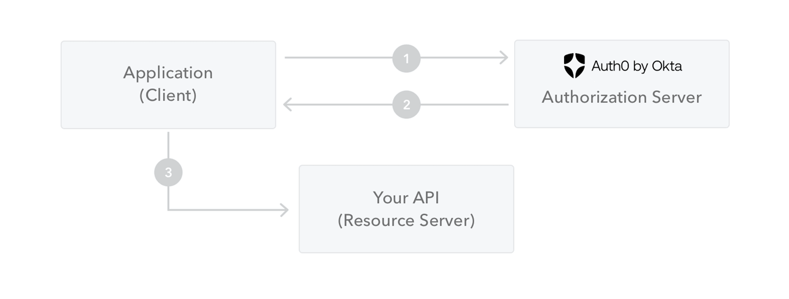

# JWT

## JWT(JSON Web Token)

### 등장 계기

기존에는 [**쿠키-세션 방식**](cookie-session.md)을 통해 사용자 인증을 수행하였다. 이 방법은 서버가 사용자를 식별하기 위해 사용자의 정보를 서버에 저장하고 있어야 했고, 이는 다음의 문제를 발생시켰다.

1. 모든 사용자의 정보를 저장해야 하기 때문에 서버에 부하를 일으킨다.
2. 서버를 확장하기 어려워진다. 서버가 여러 대가 되면 세션 정보를 공유해야 하는데, 이 과정이 복잡하기 때문

따라서 Stateful 방식으로 사용자 정보를 관리하는 것에 어려움을 느끼게 되었고, 이에 대한 대안으로 등장한 Stateless 방식의 인증 기법이 바로 **Token을 이용한 인증 기법**이다.

### 정의

- JSON 형식의 데이터를 이용하는 토큰
- jwt 는 검증 가능한(can be verified) 데이터 통신을 위한 것
    - **주의. 암호화된 데이터 통신을 위한 것이 아님!!!**
- 내부의 데이터는 **누구나 볼 수 있음** 하지만 변조는 불가능
    - SIGNATURE 부분은 헤더, 페이로드를 기반으로 secret key(HMAC) 또는 public/private key pair(RSA/ECDSA)를 사용한 알고리즘을 통해 계산됨
    - 따라서, SIGNATURE 부분이 변경되면 유효하지 않은 것으로 판단
        - header, body가 변조되었거나 이들을 암호화하는 알고리즘 또는 key 값이 변조되었거나임
        - header, body가 같고 암호화 알고리즘과 key 값 모두 같아야 signature가 같기 때문

### 구조

```java
header.payload.signature
```

- 3가지 구역은 각각에 해당하는 json 데이터를 BASE64로 인코딩한 것
- 각 json의 키값은 compact하게 표현하는 것을 권장함

1. **Header**

```java
{
	"alg": "HS256",
	"typ": "JWT"
}
```

- sign 과정에서 사용된 알고리즘 (HS256, RSA256 등등…)
- 토큰의 타입 (JWT)

2. **Payload**

```java
{
	exp: 1712120600083,
	id: 12873,
	name: "alice"
}
```

- Claim을 포함한 데이터
- Claim이란? 해당 데이터에 대한 부가 설명
    - **`registered`**
        - 발행자, 만료시간, subject, audience 등
        - https://datatracker.ietf.org/doc/html/rfc7519#section-4.1
    - **`public`**
        - jwt를 사용할 때 사용하는 부가 정보들
        - https://www.iana.org/assignments/jwt/jwt.xhtml
        - registered 과 중복되는 것들 있음. 위에 있는 명세 데이터들이 public claim 에 해당
    - **`private`**
        - registered, public 에 해당하지 않는 커스텀 데이터
        - 위 데이터의 id, name 같은 값

3. **Signature**

```json
HMACSHA256(
	base64UrlEncoded(header) + "." + base64UrlEncoded(payload),
	secret key
)
```

```json
RSASHA256(
	base64UrlEncoded(header) + "." + base64UrlEncoded(payload),
	public key,
	private key
)
```

- 해당 JWT에 대한 서명. 토큰이 변조되지 않았음을 보장하기 위해 존재
- 미리 약속된 키를 통해 검증함으로써 이 토큰이 알맞은 사람에게서 발행되었음도 검증 가능
- 인코딩된 헤더, 페이로드 값, 키값을 기반으로 암호화된 데이터

## 유의 사항

- **보안 위험이 있는 데이터는 넣으면 안 됨. 단순 인코딩된 문자열이므로 누구든 내부 데이터를 확인할 수 있음**
    - 변조를 방지한다지 데이터를 은닉하는 기능은 없음
- 보통 Authorization 헤더에 담아 보내는 형식을 사용. 헤더 사이즈가 너무 크면 처리하지 못하는 서버들이 생겨 jwt 토큰 사이즈는 최대한 작게 만드는 것을 권장함
    - 헤더 크기가 8KB가 넘지 않도록 하는 것이 좋다고 함

## 발급 및 사용 절차



1. 클라이언트가 인증 서버에 인증 요청을 한다.
2. 인증 절차에 통과하면, 인증 서버는 액세스 토큰을 반환한다.
3. 클라이언트는 토큰과 함께 리소스 서버의 보호 자원에 접근한다.

## 출처

[JWT.IO - JSON Web Tokens Introduction](https://jwt.io/introduction)
